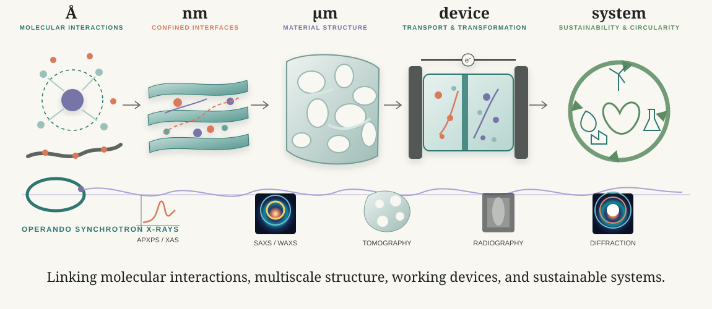

  <header class="research-hero">
    
RESEARCH

    <h1>Understanding interfaces and transport across scales.</h1>
    
We study how dynamic interfaces and confined environments control transport and transformation. Materials synthesis, electrochemistry, and <em>operando</em> synchrotron X-rays are integrated throughout our research.

  </header>

  

    
  

  <section class="research-direction" id="interfaces">
    

      
01<b>ELECTROCHEMICAL INTERFACES</b>

      <h2>Dynamic interfaces during electrochemical transformations.</h2>
      
We investigate how structure, phases, gases, liquids, and transport reorganize at working interfaces. Carbon dioxide conversion and ammonia oxidation provide model systems for resolving these dynamic interfacial processes.

      
OPERANDO VIEW<b>Radiography · Diffraction · APXPS / XAS</b>

    

    

      

        
CARBON DIOXIDE CONVERSION

        <svg viewBox="0 0 570 330" role="img" aria-label="Carbon dioxide conversion investigated by operando radiography and diffraction">
          <defs><linearGradient id="cellwater" x1="0" x2="1"><stop offset="0" stop-color="#d9ece8"/><stop offset="1" stop-color="#f1eee7"/></linearGradient></defs>
          <g transform="translate(18 38)">
            <rect x="0" y="35" width="34" height="160" rx="5" fill="#555954"/>
            <rect x="36" y="45" width="205" height="140" rx="10" fill="url(#cellwater)" stroke="#2d7771" stroke-width="2"/>
            <rect x="137" y="45" width="9" height="140" fill="#2d7771" opacity=".75"/>
            <rect x="243" y="35" width="34" height="160" rx="5" fill="#555954"/>
            <g fill="#d97a5d"><circle cx="72" cy="79" r="7"/><circle cx="105" cy="132" r="5"/><circle cx="184" cy="92" r="6"/><circle cx="205" cy="153" r="5"/></g>
            <g fill="#7775a8"><circle cx="87" cy="152" r="6"/><circle cx="166" cy="126" r="6"/><circle cx="219" cy="70" r="5"/></g>
            <g stroke="#2d7771" stroke-width="3" fill="none"><path d="M58 162 C88 143 107 111 126 72"/><path d="M221 62 C198 89 179 121 161 161"/></g>
            <text x="55" y="20" font-size="17" font-family="Arial" fill="#333">working electrochemical interface</text>
          </g>
          <g transform="translate(330 28)">
            <text x="0" y="20" font-size="15" font-family="Arial" font-weight="700" fill="#2d7771">RADIOGRAPHY</text>
            <g transform="translate(0 38)">
              <rect x="0" y="0" width="46" height="70" fill="#d9d9d5"/><ellipse cx="23" cy="37" rx="15" ry="22" fill="#777" opacity=".45"/>
              <rect x="55" y="0" width="46" height="70" fill="#d0d0cc"/><ellipse cx="78" cy="32" rx="18" ry="25" fill="#666" opacity=".55"/>
              <rect x="110" y="0" width="46" height="70" fill="#c9c9c5"/><ellipse cx="133" cy="28" rx="20" ry="27" fill="#555" opacity=".63"/>
              <rect x="165" y="0" width="46" height="70" fill="#c2c2be"/><ellipse cx="188" cy="24" rx="21" ry="29" fill="#444" opacity=".7"/>
            </g>
            <text x="0" y="130" font-size="13" font-family="Arial" fill="#666">gas + liquid redistribution</text>
            <text x="0" y="173" font-size="15" font-family="Arial" font-weight="700" fill="#d97a5d">DIFFRACTION</text>
            <g transform="translate(0 190)">
              <rect x="0" y="0" width="50" height="66" rx="3" fill="#17234f"/><path d="M4 58 Q25 18 46 58" fill="none" stroke="#f3a92b" stroke-width="5"/><path d="M9 58 Q25 31 42 58" fill="none" stroke="#56a0d3" stroke-width="3"/>
              <rect x="59" y="0" width="50" height="66" rx="3" fill="#17234f"/><path d="M63 58 Q84 22 105 58" fill="none" stroke="#f3a92b" stroke-width="5"/><path d="M68 58 Q84 34 101 58" fill="none" stroke="#56a0d3" stroke-width="3"/>
              <rect x="118" y="0" width="50" height="66" rx="3" fill="#17234f"/><path d="M122 58 Q143 28 164 58" fill="none" stroke="#f3a92b" stroke-width="5"/><path d="M127 58 Q143 39 160 58" fill="none" stroke="#56a0d3" stroke-width="3"/>
              <rect x="177" y="0" width="50" height="66" rx="3" fill="#17234f"/><path d="M181 58 Q202 34 223 58" fill="none" stroke="#f3a92b" stroke-width="5"/><path d="M186 58 Q202 43 219 58" fill="none" stroke="#56a0d3" stroke-width="3"/>
            </g>
            <text x="0" y="275" font-size="13" font-family="Arial" fill="#666">phase + structure evolution</text>
          </g>
        </svg>
      

      

        
AMMONIA OXIDATION

        <svg viewBox="0 0 570 330" role="img" aria-label="Conceptual ammonia oxidation interface investigated by operando surface spectroscopy">
          <g transform="translate(30 45)">
            <g fill="#7775a8" stroke="#565485" stroke-width="1"><circle cx="25" cy="85" r="14"/><circle cx="55" cy="85" r="14"/><circle cx="85" cy="85" r="14"/><circle cx="115" cy="85" r="14"/><circle cx="145" cy="85" r="14"/><circle cx="175" cy="85" r="14"/><circle cx="205" cy="85" r="14"/></g>
            <g fill="#d97a5d"><circle cx="44" cy="61" r="8"/><circle cx="101" cy="58" r="8"/><circle cx="159" cy="61" r="8"/></g>
            <g fill="#a9c9c3"><circle cx="43" cy="39" r="6"/><circle cx="101" cy="34" r="6"/><circle cx="158" cy="40" r="6"/></g>
            <path d="M235 72 H276" stroke="#2d7771" stroke-width="3"/><path d="M266 63 l13 9 -13 9" fill="#2d7771"/>
            <g transform="translate(292 0)">
              <g fill="#7775a8" stroke="#565485" stroke-width="1"><circle cx="25" cy="85" r="14"/><circle cx="55" cy="85" r="14"/><circle cx="85" cy="85" r="14"/><circle cx="115" cy="85" r="14"/><circle cx="145" cy="85" r="14"/><circle cx="175" cy="85" r="14"/><circle cx="205" cy="85" r="14"/></g>
              <g fill="#d97a5d"><circle cx="39" cy="57" r="8"/><circle cx="74" cy="47" r="8"/><circle cx="111" cy="56" r="8"/><circle cx="148" cy="45" r="8"/><circle cx="187" cy="56" r="8"/></g>
              <g fill="#a9c9c3"><circle cx="72" cy="25" r="6"/><circle cx="148" cy="23" r="6"/></g>
            </g>
            <text x="0" y="122" font-size="13" font-family="Arial" fill="#666">surface reconstruction under reaction conditions</text>
          </g>
          <g transform="translate(34 195)">
            <text x="0" y="0" font-size="15" font-family="Arial" font-weight="700" fill="#7775a8">OPERANDO APXPS / XAS</text>
            <path d="M0 90 H490" stroke="#bbb"/>
            <path d="M5 80 C45 78 50 66 65 35 C78 8 89 67 108 77 C145 88 173 80 185 53 C197 28 208 68 230 78 C266 88 296 81 307 45 C318 10 331 67 352 77 C390 88 420 80 435 42 C447 11 459 68 486 78" fill="none" stroke="#d97a5d" stroke-width="2.5"/>
            <path d="M5 83 C45 80 54 70 66 48 C79 23 91 69 110 79 C145 86 175 82 186 62 C199 40 210 71 231 80 C266 86 297 82 308 57 C321 31 333 70 353 79 C390 86 422 82 436 54 C450 29 462 70 486 79" fill="none" stroke="#2d7771" stroke-width="2" opacity=".85"/>
          </g>
        </svg>
        
Conceptual schematic

      

    

  </section>

  <section class="research-direction" id="transport">
    

      
02<b>2D MATERIALS FOR CONFINED TRANSPORT</b>

      <h2>Engineering 2D materials to control transport under confinement.</h2>
      
We synthesize and assemble laminar 2D materials with tunable chemistry and interlayer environments, then connect molecular confinement to mesoscale structure and selective ion transport.

      
SYNTHESIZE<i>→</i>CHARACTERIZE<i>→</i>UNDERSTAND TRANSPORT

    

    

      

        
SYNTHESIZE

        <svg viewBox="0 0 300 270" role="img" aria-label="Layered 2D materials with ions and confined water">
          <g stroke="#2d7771" stroke-width="5" fill="#b7d6d0"><path d="M25 54 C90 35 205 65 275 45 L270 73 C200 89 90 62 29 80 Z"/><path d="M25 117 C90 98 205 128 275 108 L270 136 C200 152 90 125 29 143 Z"/><path d="M25 180 C90 161 205 191 275 171 L270 199 C200 215 90 188 29 206 Z"/></g>
          <g fill="#7775a8"><circle cx="92" cy="99" r="10"/><circle cx="171" cy="92" r="10"/><circle cx="214" cy="157" r="10"/></g><g fill="#d97a5d"><circle cx="135" cy="91" r="8"/><circle cx="122" cy="159" r="8"/><circle cx="240" cy="93" r="8"/></g><g fill="#a9c9c3"><circle cx="69" cy="99" r="6"/><circle cx="110" cy="101" r="6"/><circle cx="151" cy="159" r="6"/><circle cx="230" cy="158" r="6"/></g>
        </svg>
        
2D building blocks Intercalation · Surface chemistry

      

      

        
CHARACTERIZE

        

          

          

          

        

        
3D MORPHOLOGYSAXS (2D)WAXS (2D)

        
Tomography · Scattering · Diffraction · Spectroscopy

      

      

        
UNDERSTAND TRANSPORT

        <svg viewBox="0 0 330 270" role="img" aria-label="Selective ion transport through confined 2D channels">
          <path d="M20 55 C95 40 232 69 310 52" fill="none" stroke="#2d7771" stroke-width="6"/><path d="M20 116 C95 101 232 130 310 113" fill="none" stroke="#2d7771" stroke-width="6"/><path d="M20 177 C95 162 232 191 310 174" fill="none" stroke="#2d7771" stroke-width="6"/><path d="M20 238 C95 223 232 252 310 235" fill="none" stroke="#2d7771" stroke-width="6"/>
          <g fill="#7775a8"><circle cx="75" cy="89" r="10"/><circle cx="167" cy="150" r="10"/><circle cx="263" cy="210" r="10"/></g><g fill="#d97a5d"><circle cx="122" cy="90" r="7"/><circle cx="215" cy="149" r="7"/><circle cx="285" cy="88" r="7"/></g><g fill="#a9c9c3"><circle cx="54" cy="91" r="5"/><circle cx="94" cy="91" r="5"/><circle cx="149" cy="150" r="5"/><circle cx="185" cy="150" r="5"/></g>
          <path d="M56 207 C105 175 135 181 164 149 C199 110 235 117 278 78" fill="none" stroke="#d97a5d" stroke-width="2.5" stroke-dasharray="7 6"/><path d="M270 72 l13 3 -8 11" fill="#d97a5d"/>
        </svg>
        
Tunable interlayer chemistry Controlled hydration environment Selective ion transport

      

    

  </section>

  <aside class="research-integrated-note"><b>INTEGRATED APPROACH</b>Across both directions, operando X-ray characterization connects molecular interactions, evolving material structure, and functional performance.</aside>

